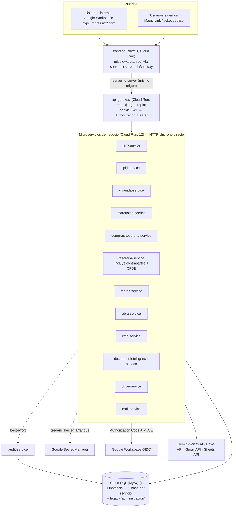
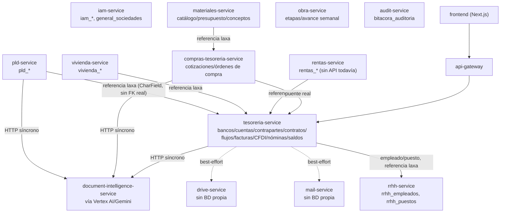
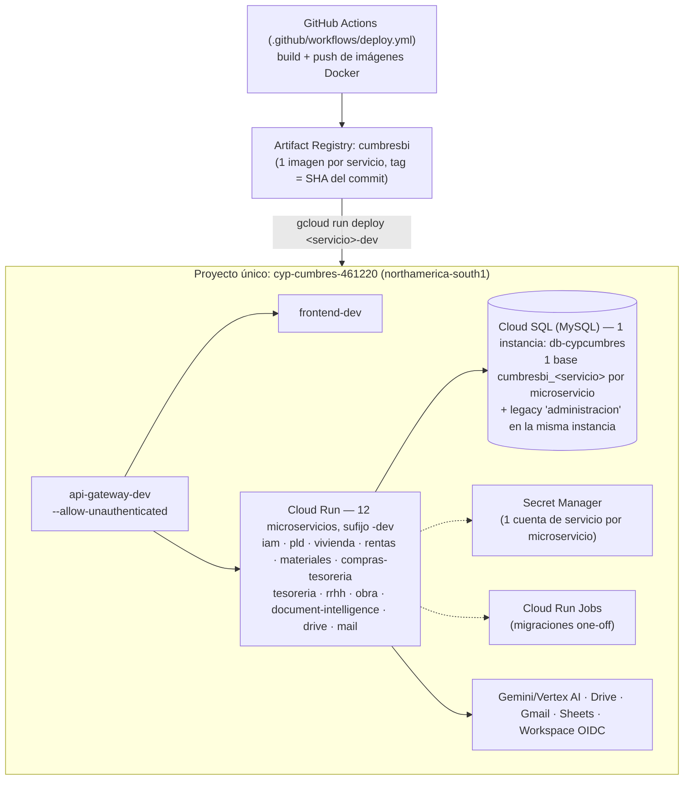
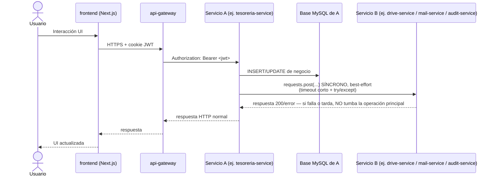
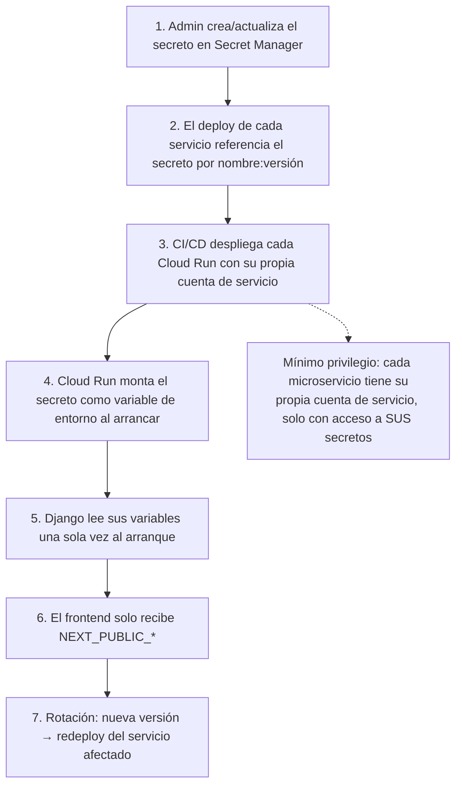
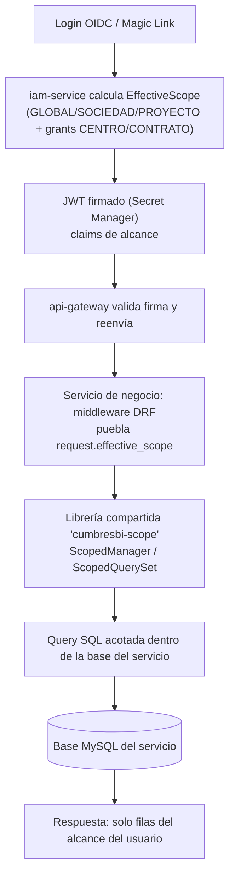
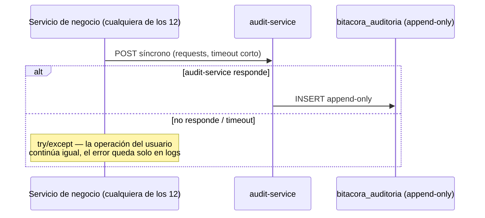

# CumbresBI — Documentación Oficial de Arquitectura

**Cumbres Consultoría y Proyectos** · Documento de arquitectura — actualizado 17/Sep/2026, refleja el sistema real desplegado

> **Nota histórica:** una versión anterior de este documento (y de los diagramas en `docs/architecture/diagrams/`) describía una arquitectura *planeada* — microservicios de grano muy fino (`contrapartes-service`, `facturacion-cfdi-service`, `ventas-vivienda-service`, `tickets-service`, etc.) comunicados de forma asíncrona vía Google Pub/Sub con patrón *Transactional Outbox*. **Esa arquitectura nunca se construyó así.** Lo que realmente se implementó es más simple: menos servicios (varios dominios fusionados dentro de uno solo), sin bus de eventos, con llamadas HTTP síncronas directas entre servicios. Este documento describe el sistema **real**, verificado contra el código.

Este documento es la referencia oficial de arquitectura de CumbresBI, la plataforma que reemplaza los flujos operativos dispersos en Google AppSheet por un sistema unificado de Inteligencia de Negocio. Todo desarrollador, revisor técnico y stakeholder de Dirección debe usarlo como fuente única de verdad sobre cómo está construido el sistema.

Cada diagrama existe en dos formas equivalentes: **Mermaid** (embebido abajo) y **Draw.io** (`.drawio`, en [`docs/architecture/diagrams/`](docs/architecture/diagrams/), editable en [diagrams.net](https://app.diagrams.net)).

## Índice

1. [Visión general de la arquitectura](#1-visión-general-de-la-arquitectura)
2. [Diagrama de arquitectura general](#2-diagrama-de-arquitectura-general)
3. [Diagrama de componentes](#3-diagrama-de-componentes)
4. [Diagrama de despliegue en Google Cloud](#4-diagrama-de-despliegue-en-google-cloud)
5. [Comunicación entre servicios](#5-comunicación-entre-servicios)
6. [Flujo de autenticación](#6-flujo-de-autenticación)
7. [Secretos con Secret Manager](#7-secretos-con-secret-manager)
8. [Arquitectura de RLS](#8-arquitectura-de-rls)
9. [Flujo de auditoría](#9-flujo-de-auditoría)
10. [Motor Inteligente de Procesamiento Documental](#10-motor-inteligente-de-procesamiento-documental)
11. [Decisiones reales y contrapartidas conocidas](#11-decisiones-reales-y-contrapartidas-conocidas)

---

## 1. Visión general de la arquitectura

CumbresBI se organiza como un conjunto de **microservicios** (Django REST Framework por servicio), cada uno dueño de un subconjunto de tablas del esquema MySQL heredado de AppSheet, desplegados como servicios independientes en **Google Cloud Run** y expuestos a través de un **API Gateway propio** (una app Django que hace de proxy — no un producto administrado tipo Cloud Endpoints/Apigee). Todos los servicios comparten una **única instancia física de Cloud SQL** (`db-cypcumbres`) — que además comparte con el sistema legacy `administracion`, todavía en producción real — pero cada servicio tiene su propia base lógica y su propio usuario de base de datos, sin joins directos entre esquemas.

La comunicación entre servicios de negocio es **HTTP síncrona directa** (librería `requests` de Python). No existe bus de eventos, Pub/Sub, ni patrón *Transactional Outbox* en ningún lugar del sistema. Las llamadas a servicios de soporte (`audit-service`, `mail-service`, `drive-service`) siguen un patrón **best-effort**: timeout corto + `try/except`, de forma que si el servicio de soporte falla o tarda, la operación principal del usuario no se ve afectada — solo se degrada esa función puntual.

### 1.1 Catálogo real de microservicios (12 + gateway + frontend = 15 despliegues Cloud Run)

| Servicio | Tablas que posee | Rol |
|---|---|---|
| `iam-service` | `iam_users`, `iam_identities`, `iam_roles`, `iam_permissions`, `iam_role_permissions`, `iam_user_roles`, `iam_user_centro_access`, `iam_user_contrato_access`, `general_sociedades`, `iam_invitations`, `iam_magic_links`, `iam_external_collaborators`, `iam_google_personal_tokens`, `iam_groups` | Identidad, roles, permisos y cálculo del alcance efectivo (RLS). Emite el JWT de alcance que consume todo el sistema. |
| `audit-service` | `bitacora_auditoria` | Receptor centralizado de las llamadas de auditoría de todos los demás servicios (síncrono, best-effort) — vista única y cronológica, requisito de cumplimiento PLD/AML. |
| `document-intelligence-service` (docint) | Ninguna tabla de negocio | Motor Inteligente de Procesamiento Documental — invocado síncronamente, vía Gemini/Vertex AI. |
| `pld-service` | `pld_contrapartes_kyc`, `pld_contrapartes_docs`, `pld_ticket_cliente` | Cumplimiento/KYC. Invoca síncronamente a `document-intelligence-service`. |
| `vivienda-service` | `vivienda_proyectos`, `vivienda_listado`, `vivienda_ventas_asesores`, `vivienda_ventas_expedientes`, `vivienda_ventas_expedientes_items`, `vivienda_rel_expediente_clientes` | Ventas de Vivienda. Edificios (línea de producto paralela) sigue sin construir, cero código. |
| `rentas-service` | `rentas_contratos`, `rentas_contratos_docs`, `rentas_inmuebles`, `rentas_inmuebles_contratos`, `rentas_ubicaciones`, `rentas_referencias_pago` | Arrendamiento comercial. Modelos completos, **sin API/pantallas construidas todavía**. |
| `materiales-service` | Catálogo de materiales/mano de obra, presupuesto/conceptos | Requisición de Materiales construida; falta exportar a Excel y captura por cámara. |
| `compras-tesoreria-service` | Proveedores, cotizaciones, órdenes de compra | Puente entre Materiales y Tesorería — orquesta cotizaciones/órdenes de compra. |
| `tesoreria-service` | `tesoreria_cuentas`, `tesoreria_bancos`, `tesoreria_contratos`, `tesoreria_flujos`, `tesoreria_facturas`, `tesoreria_complementos_pago`, `tesoreria_notas_credito`, `tesoreria_saldos`, `tesoreria_cortes_edc`, `tesoreria_contrapartes`, `tesoreria_contrapartes_relacion`, `factura_conceptos`, `factura_doctos_relacionados`, `factura_notas_credito`, `factura_traslados`, `tesoreria_rec_nominas`, `tesoreria_nominas`, `tesoreria_nominas_sociedades`, `tesoreria_tickets_reembolso`, `tesoreria_solicitudes_pago`, `tesoreria_movimientos_bancarios` | El módulo más grande y avanzado: cuentas, contrapartes (catálogo maestro), contratos, flujos, facturación CFDI, nóminas, conciliación de facturas, conciliación bancaria (parcial), reembolsos, solicitudes de pago. **Contrapartes y facturación CFDI viven aquí, no en servicios separados.** |
| `obra-service` | `obra_etapas`, avance semanal por lote/manzana | Registro de avance de obra, dos vistas (semanal editable con aprobación, general solo lectura). |
| `rrhh-service` | `rrhh_empleados`, `rrhh_puestos` | Datos de empleados y puestos. Portal MiCumbres (autoservicio) apenas cubre tickets de reembolso/solicitud de pago. |
| `drive-service` | Sin BD propia | Puente hacia Google Drive API (domain-wide delegation, Workspace de `cypcumbres.mx`). |
| `mail-service` | Sin BD propia | Puente hacia Gmail API (domain-wide delegation) para correos reales. |
| `api-gateway` | Sin BD propia | Único punto público (`--allow-unauthenticated`). Traduce la cookie JWT del navegador a header `Authorization: Bearer` y reenvía al servicio real según el primer segmento del path. |
| `frontend` | N/A | Next.js. El navegador nunca llama directo al gateway — un `middleware.ts` reenvía server-to-server, evitando el bloqueo de cookies cross-site entre subdominios `.run.app`. |

**No existen** (a diferencia de versiones anteriores de este documento): `contrapartes-service`, `facturacion-cfdi-service`, `ventas-vivienda-service` (se llama `vivienda-service`), `compras-service` (es `compras-tesoreria-service`), `tickets-service` (el módulo Tickets no tiene ni una línea de código).

### 1.2 Reglas no negociables (vigentes)

1. **Cero contraseñas** — OIDC (internos, dominios `cypcumbres.mx`/`cypcumbres.com`), Magic Links de 30 min (acción externa puntual) o acceso de colaborador externo permanente revocable (`IamExternalCollaborator`), los tres resueltos por `iam-service`.
2. **RLS por alcance** (GLOBAL/SOCIEDAD/PROYECTO/CENTRO/CONTRATO) — JWT firmado por `iam-service`, validado por el API Gateway, aplicado en cada servicio mediante la librería compartida `cumbresbi-scope` (`ScopedManager`/`ScopedQuerySet`).
3. **Auditoría inmutable append-only** — cada servicio llama síncronamente (best-effort) a `audit-service`, único escritor de `bitacora_auditoria`.
4. **Secretos únicamente en Google Secret Manager** — 12+ cuentas de servicio distintas, cada una con acceso de mínimo privilegio solo a sus propios secretos.
5. **Sin almacenamiento local de archivos** — streaming vía Google Drive API.

---

## 2. Diagrama de arquitectura general



📄 Editable: [`docs/architecture/diagrams/01-arquitectura-general.drawio`](docs/architecture/diagrams/01-arquitectura-general.drawio)

**Lectura del diagrama:** el frontend solo conoce el API Gateway — nunca llama directamente a un microservicio, a Cloud SQL ni a servicios externos. El Gateway valida el JWT (emitido por `iam-service`) y lo reenvía como header estándar. **Toda** la comunicación entre servicios es HTTP síncrono — no hay excepción "async por defecto, síncrono solo cuando el usuario espera": es síncrono siempre, con manejo best-effort donde el fallo no debe bloquear al usuario.

---

## 3. Diagrama de componentes



📄 Editable: [`docs/architecture/diagrams/02-componentes.drawio`](docs/architecture/diagrams/02-componentes.drawio)

**Nota sobre `tesoreria-service`:** no hay ningún servicio de "contrapartes" ni de "facturación CFDI" separado — ambos dominios viven dentro de `tesoreria-service` desde el principio. Las referencias entre servicios (ej. `vivienda-service` → contraparte de `tesoreria-service`) son campos planos (`CharField`, guardando el RFC o el id) sin `ForeignKey` real ni evento de sincronización — es responsabilidad de cada servicio validar al escribir.

---

## 4. Diagrama de despliegue en Google Cloud



📄 Editable: [`docs/architecture/diagrams/03-despliegue-gcp.drawio`](docs/architecture/diagrams/03-despliegue-gcp.drawio)

**Un único proyecto de GCP** (`cyp-cumbres-461220`) — no hay proyectos separados de `dev`/`staging`/`prod` todavía; el ambiente se distingue solo por el sufijo `-dev` en cada servicio de Cloud Run. `--no-allow-unauthenticated` a nivel de Cloud Run en los 12 microservicios de negocio, pero con `roles/run.invoker` otorgado a `allUsers` — la seguridad real la da el JWT de la app (`CUMBRESBI_SCOPE_JWT_PUBLIC_KEY`), no el IAM nativo de Cloud Run. `min-instances=1` en `iam`, `tesoreria`, `api-gateway`, `frontend`, `audit`, `pld`, `vivienda`, `drive`, `mail` y `document-intelligence` (evita cold start/502 en los que se usan seguido); el resto queda en `min-instances=0`.

---

## 5. Comunicación entre servicios



📄 Editable: [`docs/architecture/diagrams/04-comunicacion-servicios.drawio`](docs/architecture/diagrams/04-comunicacion-servicios.drawio)

**No hay bus de eventos, Pub/Sub ni patrón saga.** Toda comunicación entre servicios es una llamada HTTP síncrona directa. La única distinción real es si la llamada es "dura" (bloquea la operación si falla — ej. validar el JWT) o "best-effort" (auditoría/correo/Drive — se degrada la función puntual, la operación principal del usuario sigue).

---

## 6. Flujo de autenticación

### 6.1 Usuarios internos — Google Workspace OIDC (Authorization Code + PKCE), a cargo de `iam-service`

```mermaid
sequenceDiagram
    actor U as Usuario interno
    participant W as frontend (Next.js)
    participant IAMS as iam-service
    participant G as Google Workspace OIDC

    U->>W: Clic "Iniciar sesión con Google"
    W->>IAMS: Redirige a /auth/google/start (vía proxy server-to-server)
    IAMS->>G: Authorization Request (PKCE)
    G->>U: Solicita autenticación
    U->>G: Se autentica en Google Workspace
    G->>IAMS: Redirige a <frontend>/iam/auth/google/callback?code=...
    IAMS->>G: Intercambia code por tokens (valida code_verifier)
    alt claim "hd" en dominios aprobados (cypcumbres.mx, cypcumbres.com)
        IAMS->>IAMS: _upsert_identity: ¿ya existe IamUser (no DELETED)?<br/>si no, requiere IamInvitation pendiente<br/>crea/actualiza iam_identities + iam_users
        alt status ACTIVE
            IAMS-->>W: Cookie de sesión (JWT firmado RS256, claims de alcance)<br/>HttpOnly; Secure; SameSite=None (server-to-server)
        else SUSPENDED/DELETED o sin invitación
            IAMS-->>W: Redirige a /login?error=... — sin sesión emitida
        end
    else dominio no aprobado
        IAMS-->>W: Redirige a /login?error=oidc
    end
```

📄 Editable: [`docs/architecture/diagrams/05-flujo-oidc.drawio`](docs/architecture/diagrams/05-flujo-oidc.drawio)

**Cambio real de arquitectura (16/Sep/2026):** el `OIDC_REDIRECT_URI` apunta al **frontend**, no al gateway — porque la cookie PKCE vive ahí (host-only). El navegador ya no llama directo al gateway: `frontend/src/middleware.ts` reenvía `/iam/*`, `/pld/*`, etc. server-to-server (mismo origen, sin restricción de cookies cross-site que sí existe entre subdominios distintos de `.run.app`).

Gate de invitación formal (`IamInvitation`): un correo que **ya tiene** `IamUser` (no `DELETED`) entra con login libre. Uno nuevo necesita que un IAM Admin lo haya invitado primero.

### 6.2 Usuarios externos — Magic Link de un solo uso

Para una acción puntual sin cuenta (ej. proveedor sube un documento) — vence en 30 minutos, un solo uso, NO crea `IamUser` real.

### 6.3 Colaborador externo sin Workspace — acceso permanente revocable (`IamExternalCollaborator`)

Para alguien sin correo de Workspace que necesita navegar secciones reales con roles propios (ej. contador externo). **Sí crea un `IamUser` real** (`access_mode=RESTRICTED`). El link no vence por tiempo, solo se revoca a mano.

**Envío real de correo:** los tres mecanismos mandan correo real vía `mail-service` (Gmail API, domain-wide delegation en `cypcumbres.mx`).

---

## 7. Secretos con Secret Manager



📄 Editable: [`docs/architecture/diagrams/06-flujo-secretos.drawio`](docs/architecture/diagrams/06-flujo-secretos.drawio)

Secretos gestionados: contraseña de BD y Django secret key por servicio, `GEMINI_API_KEY` (docint), credenciales OIDC (`iam-service`), `CUMBRESBI_SCOPE_JWT_PUBLIC_KEY` (compartida, todos los servicios), cuentas de servicio de Drive/Gmail (domain-wide delegation), `GOOGLE_PERSONAL_OAUTH_CLIENT_SECRET` (exportación a Sheets).

---

## 8. Arquitectura de RLS



📄 Editable: [`docs/architecture/diagrams/07-arquitectura-rls.drawio`](docs/architecture/diagrams/07-arquitectura-rls.drawio)

**Sin canal de revocación forzada:** un cambio de permisos o rol requiere que el usuario **cierre sesión y vuelva a entrar** para que el JWT se recalcule — no existe ningún evento de revocación en tiempo real (no hay Pub/Sub en el sistema). Esto ya se confirmó como comportamiento esperado varias veces (ej. tras el fix de `identity_user_id`, tras el cumplimiento de permisos de escritura).

**Riesgo real:** con 12 servicios consumiendo la misma librería `cumbresbi-scope`, una versión desalineada entre servicios podría aplicar un filtro de alcance inconsistente sin ninguna señal en tiempo de ejecución — no hay hoy un gate de CI que fuerce una "floor version" mínima.

---

## 9. Flujo de auditoría



📄 Editable: [`docs/architecture/diagrams/08-flujo-auditoria.drawio`](docs/architecture/diagrams/08-flujo-auditoria.drawio)

**Sin outbox ni cola de reintentos:** es una llamada fire-and-forget con timeout. Si `audit-service` está caído en el momento exacto de una acción, esa acción **no queda registrada** — riesgo aceptado, no un bug, pero real para cualquier caso de cumplimiento que exija garantía de entrega.

`bitacora_auditoria` es append-only: el usuario runtime no tiene privilegio `UPDATE`/`DELETE`/`DROP` a nivel de motor de BD, ni siquiera un Super Admin de la aplicación puede editar una entrada ya escrita.

---

## 10. Motor Inteligente de Procesamiento Documental

```mermaid
sequenceDiagram
    actor U as Usuario
    participant M as Servicio consumidor (pld / compras-tesoreria / materiales / rrhh / tesoreria)
    participant DI as document-intelligence-service
    participant P as GeminiProvider (vía Vertex AI)

    U->>M: Carga documento (streaming vía Drive, sin disco local)
    M->>DI: POST /analyze — llamada síncrona
    DI->>DI: classifier.py — clasificación previa por nombre de archivo
    DI->>P: analyze(request)
    P-->>DI: DocumentAnalysisResult (tipo, confianza, JSON;<br/>dato ausente = null, nunca inferido)
    DI->>DI: validators.py — JSON, tipos, campos obligatorios
    alt inconsistencia (ej. nombre de archivo ≠ contenido)
        DI-->>M: se detiene, solicita revisar/reemplazar
    else resultado válido
        DI-->>M: DocumentAnalysisResult validado
        M-->>U: presenta para revisión/edición
        U->>M: confirma explícitamente
        M->>M: persiste en su propio esquema
        M->>M: llama a audit-service (síncrono, best-effort)
    end
```

📄 Editable: [`docs/architecture/diagrams/09-motor-documental.drawio`](docs/architecture/diagrams/09-motor-documental.drawio)

**Contrato (sin cambios):**

```python
@dataclass(frozen=True)
class DocumentAnalysisRequest:
    document_ref: DriveFileRef       # streaming, nunca ruta local
    expected_document_type: str      # namespaced por servicio: "pld.ine", "compras.cotizacion"
    metadata: dict
    internal_prompt_key: str

@dataclass(frozen=True)
class DocumentAnalysisResult:
    detected_document_type: Optional[str]
    matches_expected_type: bool
    confidence: float
    extracted_data: dict             # dato ausente = None, nunca inferido
    validation_errors: list[str]
    warnings: list[str]
```

**Proveedor real:** `GeminiProvider` vía **Vertex AI** (`DOCINT_USE_VERTEX=True`, región `us-central1` — `northamerica-south1` no soporta Gemini vía Vertex). `DocumentAIProvider` sigue siendo un stub futuro, mismo contrato (patrón adaptador). Cloud Tasks (procesamiento asíncrono) queda pendiente a propósito — el análisis corre in-process síncrono, suficiente por ahora.

---

## 11. Decisiones reales y contrapartidas conocidas

### 11.1 Por qué se simplificó respecto al diseño original

| Decisión original (nunca construida) | Qué se hizo en realidad | Por qué |
|---|---|---|
| Servicios separados por dominio fino (`contrapartes-service`, `facturacion-cfdi-service`, `ventas-vivienda-service`) | Fusionados dentro de `tesoreria-service`/`vivienda-service` | Menos servicios que mantener/desplegar/monitorear para un equipo de 2 desarrolladores; el aislamiento de fallos que se buscaba no se materializó en un beneficio real a este tamaño de equipo |
| Comunicación asíncrona vía Google Pub/Sub, patrón saga + Transactional Outbox | HTTP síncrono directo, con manejo best-effort donde aplica | Pub/Sub agrega infraestructura, latencia de consistencia eventual y superficie de fallo (relay caído = hueco de auditoría) sin que el proyecto necesitara esa escala; una llamada directa con timeout ya resuelve "no tumbar la operación principal" |
| Cloud Endpoints ESPv2 como API Gateway | App Django propia (`api-gateway`) | Control total sobre la traducción cookie→Bearer y el proxy server-to-server que resolvió el bloqueo de cookies cross-site; evita depender de un producto administrado para un caso de uso específico |
| 3 proyectos GCP (dev/staging/prod) | 1 solo proyecto (`cyp-cumbres-461220`), ambientes distinguidos por sufijo `-dev` | Menor complejidad operativa mientras el proyecto no tiene todavía ni un ambiente de producción real desplegado |
| `tickets-service` como servicio nuevo | Nunca se construyó — el módulo Tickets no tiene código | Fuera de alcance priorizado hasta ahora |

### 11.2 Riesgos reales aceptados (no resueltos, documentados a propósito)

1. **Sin garantía de entrega en auditoría.** Una llamada best-effort que falla en el momento exacto de una acción sensible no deja rastro — no hay cola de reintentos ni alerta de backlog (porque no hay backlog: es fire-and-forget).
2. **Sin revocación forzada de sesión.** Un cambio de permisos/rol no se refleja hasta que el usuario cierra sesión y vuelve a entrar.
3. **Sin gate de versión mínima de `cumbresbi-scope`.** Un servicio desactualizado podría aplicar un filtro de alcance inconsistente sin señal en tiempo de ejecución.
4. **`rentas-service` sin API construida** pese a tener modelos completos — no hay fase asignada todavía para construir sus pantallas.
5. **`CENTRO`/`CONTRATO` como alcance** siguen siendo listas de acceso planas (grants), no un cuarto valor jerárquico de `scope_type`.
6. **Cold start** en los servicios sin `min-instances=1` (`materiales`, `rentas`, `obra`, `compras-tesoreria`) — no truena hoy, pero el riesgo de `502` sigue latente bajo más carga.

---

## Referencias

- **[Catálogo de roles, permisos y reglas de RLS por rol](docs/architecture/iam/roles-y-permisos.md)**
- **[Auditoría completa del esquema heredado](docs/architecture/auditoria-esquema.md)** — 49 tablas, hallazgos reales de columnas/tipos inconsistentes
- **[Google Cloud Document AI como alternativa futura](docs/architecture/document-intelligence/document-ai-alternativa-futura.md)**
- **[Progreso de despliegue a Cloud Run](docs/PROGRESO-CLOUD-RUN.md)** (local, no versionado)
- **[Progreso de migración de datos legacy](docs/migracion-datos-legacy-progreso.md)** (local, no versionado)
- Esquema de origen: [`20260727_Cumbres_ERD.sql`](20260727_Cumbres_ERD.sql), [`schema.csv`](schema.csv), [`fk_relationships.csv`](fk_relationships.csv).
