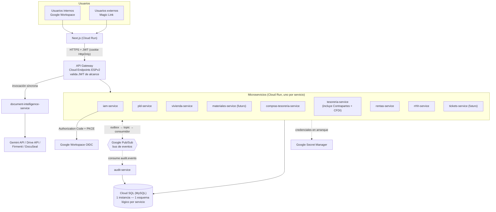
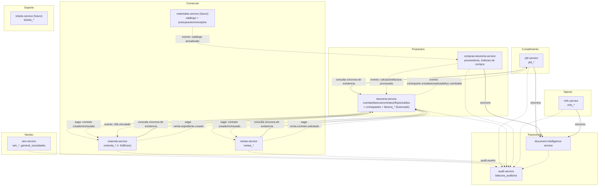
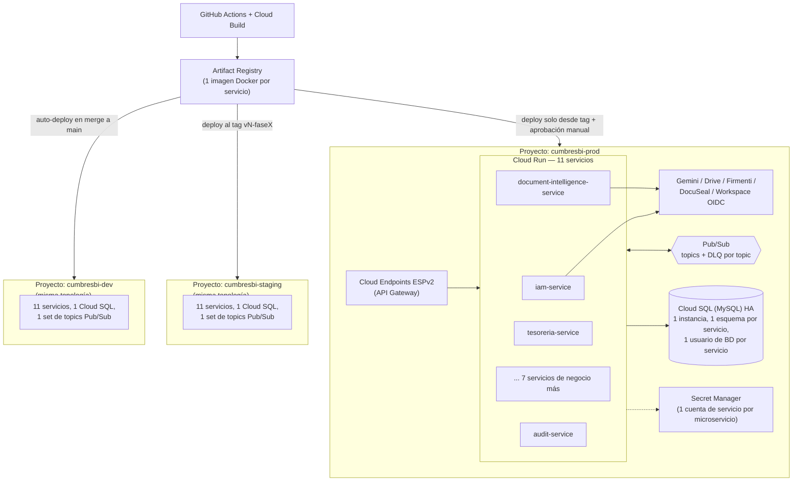
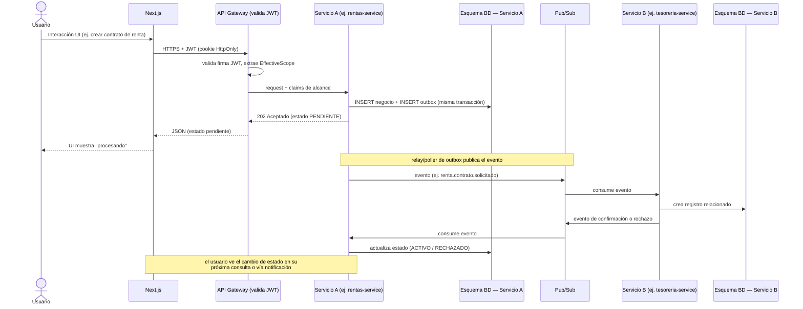
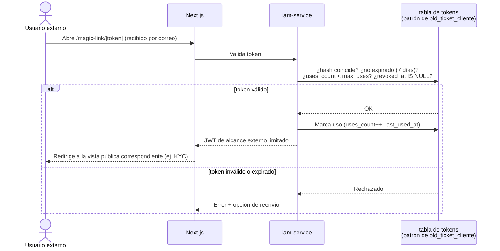
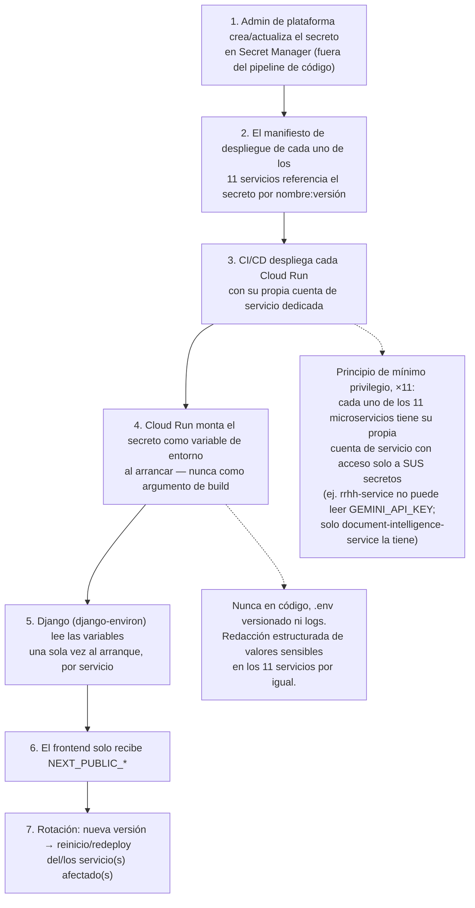
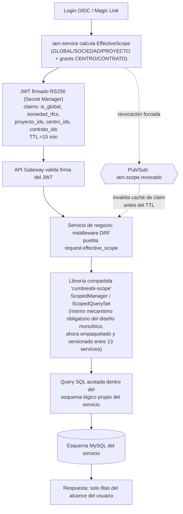
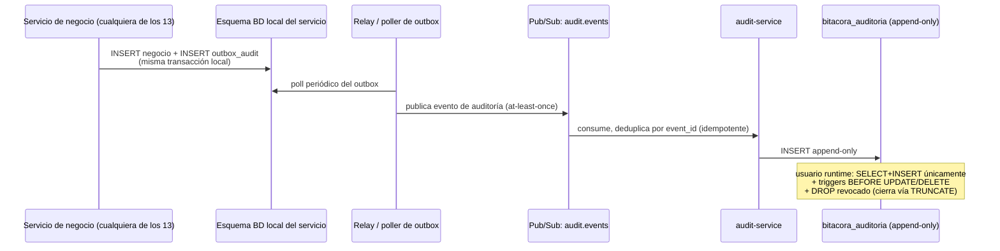

# CumbresBI — Documentación Oficial de Arquitectura

**Cumbres Consultoría y Proyectos** · Documento de arquitectura — v2.0 (microservicios) · Fase 0

> **Cambio de versión:** la v1.0 de este documento recomendaba un monolito modular Django. Por decisión explícita del cliente, la arquitectura se rediseñó a **microservicios de grano fino**, con una única Cloud SQL compartida (esquema lógico por servicio) y comunicación asíncrona basada en eventos (Google Pub/Sub). La v1.0 queda en el historial de `con-base-en-el-delightful-mccarthy.md`; este documento la reemplaza como fuente de verdad vigente. La sección 11 documenta honestamente las contrapartidas de este cambio — no se minimizan.

Este documento es la referencia oficial de arquitectura de CumbresBI, la plataforma que reemplaza los flujos operativos dispersos en Google AppSheet por un sistema unificado de Inteligencia de Negocio. Todo desarrollador, revisor técnico y stakeholder de Dirección debe usarlo como fuente única de verdad sobre cómo está construido el sistema y por qué.

Cada diagrama existe en dos formas equivalentes: **Mermaid** (embebido abajo, para lectura inmediata) y **Draw.io** (`.drawio`, en [`diagrams/`](diagrams/), para edición visual en [diagrams.net](https://app.diagrams.net) — "File → Open From → Device").

## Índice

1. [Visión general de la arquitectura](#1-visión-general-de-la-arquitectura)
2. [Diagrama de arquitectura general](#2-diagrama-de-arquitectura-general)
3. [Diagrama de componentes](#3-diagrama-de-componentes)
4. [Diagrama de despliegue en Google Cloud](#4-diagrama-de-despliegue-en-google-cloud)
5. [Diagrama de comunicación entre frontend, backend, base de datos y servicios externos](#5-diagrama-de-comunicación-entre-frontend-backend-base-de-datos-y-servicios-externos)
6. [Flujo de autenticación OIDC](#6-flujo-de-autenticación-oidc)
7. [Flujo de seguridad y manejo de secretos con Secret Manager](#7-flujo-de-seguridad-y-manejo-de-secretos-con-secret-manager)
8. [Arquitectura de RLS](#8-arquitectura-de-rls)
9. [Flujo de auditoría](#9-flujo-de-auditoría)
10. [Arquitectura del Motor Inteligente de Procesamiento Documental](#10-arquitectura-del-motor-inteligente-de-procesamiento-documental)
11. [Decisiones técnicas y justificación de alternativas](#11-decisiones-técnicas-y-justificación-de-alternativas)

---

## 1. Visión general de la arquitectura

CumbresBI se organiza como un conjunto de **microservicios de grano fino** (Django REST Framework por servicio), cada uno dueño de un subconjunto de tablas del esquema MySQL heredado, desplegados como servicios independientes en **Google Cloud Run** y expuestos a través de un **API Gateway** (Cloud Endpoints ESPv2). Todos los servicios comparten una **única instancia física de Cloud SQL (MySQL)** — decisión explícita del cliente por costo operativo — pero cada servicio tiene su propio esquema lógico y su propio usuario de base de datos, sin joins directos entre esquemas. La comunicación entre servicios de negocio es **asíncrona, basada en eventos (Google Pub/Sub)**, salvo dos excepciones justificadas: (a) las consultas síncronas de solo lectura de "existencia al momento de la transacción" (ej. validar que una contraparte existe antes de crear un contrato), y (b) la invocación al Motor Inteligente de Procesamiento Documental, que el usuario espera resolver en la misma interacción.

### 1.1 Catálogo de microservicios

#### 1.1.1 Servicios existentes en el repo (9)

| Servicio | Tablas que posee | Rol | ¿Se necesita ya en Cloud Run? |
|---|---|---|---|
| `iam-service` | `iam_users`, `iam_identities`, `iam_roles`, `iam_permissions`, `iam_role_permissions`, `iam_user_roles`, `iam_user_centro_access`, `iam_user_contrato_access`, `general_sociedades` | Identidad, roles, permisos y cálculo del alcance efectivo (RLS). Emite el JWT de alcance que consume todo el sistema. `general_sociedades` vive aquí (no en un servicio propio) por ser tabla de referencia de baja tasa de cambio y alta tasa de lectura por FK — separarla forzaría a todos los demás servicios a mantener una copia CQRS de algo que apenas cambia. | **Sí — ya** (Fase 1, en desarrollo activo: `feature/iam-permisos-reportes`) |
| `audit-service` | `bitacora_auditoria` | Consumidor centralizado de eventos de auditoría de todos los demás servicios — vista única y cronológicamente consistente, requisito de cumplimiento PLD/AML. | **Sí — ya** (Fase 1, todo módulo se integra a la bitácora desde el día uno) |
| `document-intelligence-service` | Ninguna tabla de negocio (solo su propio log de solicitudes) | Motor Inteligente de Procesamiento Documental — transversal, invocado síncronamente. | **Sí — ya** (Fase 0, ya construido en su versión base) |
| `pld-service` | `pld_contrapartes_kyc`, `pld_contrapartes_docs`, `pld_ticket_cliente` | Cumplimiento/KYC. Invoca síncronamente a `document-intelligence-service`. (Nombrado `pld-compliance-service` en versiones previas de este documento — mismo servicio.) | Puede esperar (Fase 2) |
| `vivienda-service` | `vivienda_proyectos`, `vivienda_listado`, `vivienda_ventas_asesores`, `vivienda_ventas_expedientes`, `vivienda_ventas_expedientes_items`, `vivienda_rel_expediente_clientes` (+ tablas espejo de Edificios) | Ventas de Vivienda **y** Edificios como dos líneas de producto del mismo bounded context (mismo servicio, no dos) — difieren en catálogo de producto, no en el proceso de venta/expediente. (Nombrado `ventas-vivienda-service` en versiones previas — mismo servicio.) | Puede esperar (Fase 3) |
| `compras-tesoreria-service` | Proveedores, solicitudes/órdenes de compra, recepción de materiales (tablas nuevas de la fase Compras/Tesorería) — scaffold creado, sin modelos aún | Compras: orquesta contra `materiales-service` (futuro, consume catálogo) y `tesoreria-service` (genera obligaciones de pago); reutiliza el Motor Documental para cotizaciones/facturas. | Puede esperar (Fase 4, aún sin modelos) |
| `tesoreria-service` | `tesoreria_cuentas`, `tesoreria_bancos`, `tesoreria_contratos`, `tesoreria_flujos`, `tesoreria_facturas`, `tesoreria_complementos_pago`, `tesoreria_notas_credito`, `tesoreria_saldos`, `tesoreria_cortes_edc`, `tesoreria_contrapartes`, `tesoreria_contrapartes_relacion`, `factura_conceptos`, `factura_doctos_relacionados`, `factura_notas_credito`, `factura_traslados`, `tesoreria_rec_nominas` | Tesorería operativa **+ Contrapartes + Facturación CFDI, fusionados de forma definitiva** en un solo servicio (decisión confirmada — versiones previas de este documento los proponían como 3 servicios separados: `tesoreria-service`, `contrapartes-service`, `facturacion-cfdi-service`). | Puede esperar (Fase 4) |
| `rrhh-service` | `rrhh_empleados`, `rrhh_puestos` | Onboarding, integración Firmenti/DocuSeal, portal MiCumbres (BFF de frontend, no servicio de datos nuevo). | Puede esperar (Fase 5) |
| `rentas-service` | `rentas_contratos`, `rentas_contratos_docs`, `rentas_inmuebles`, `rentas_inmuebles_contratos`, `rentas_ubicaciones`, `rentas_referencias_pago` | Arrendamiento comercial. **Gap señalado**: este dominio existe en el esquema pero el Plan de Trabajo no lo asigna a ninguna fase del cronograma de 26 semanas — ver sección de supuestos. | Puede esperar (sin fase asignada todavía) |

#### 1.1.2 Servicios planeados a futuro (aún no existen en el repo)

| Servicio | Tablas que poseerá | Rol |
|---|---|---|
| `materiales-service` | Catálogo de materiales + motor de presupuesto/conceptos automatizado (construido de forma autónoma en la fase de Ventas/Vivienda) | Dominio con ciclo de vida propio: nace en Ventas, es extendido y reconciliado por Compras. |
| `tickets-service` | `tickets`, `tickets_centros`, `tickets_dependencias`, `tickets_log`, `tickets_proyectos`, `tickets_proyectos_participantes`, `tickets_subproyectos` | Gestión interna de proyectos, autocontenido — sin dependencias de escritura cruzadas con el resto. |

Nueve servicios existentes + dos planeados = **11 despliegues Cloud Run** por ambiente (antes se documentaban 15, contando `contrapartes-service` y `facturacion-cfdi-service` como servicios propios — ahora viven dentro de `tesoreria-service`).

### 1.2 Reglas no negociables (ahora en contexto distribuido)

1. **Cero contraseñas** — OIDC (internos) / Magic Links (externos), resuelto por `iam-service`.
2. **RLS por alcance** (GLOBAL/SOCIEDAD/PROYECTO/CENTRO/CONTRATO) — ya no es un middleware local de un monolito: es un **JWT firmado por `iam-service`** con los claims de alcance, validado por el API Gateway y aplicado en cada servicio mediante una **librería Python compartida** (`cumbresbi-scope`) — ver sección 8.
3. **Auditoría inmutable append-only** — cada servicio publica eventos de auditoría (patrón *Transactional Outbox*) a un tópico Pub/Sub consumido por `audit-service`, único escritor de `bitacora_auditoria` — ver sección 9.
4. **Secretos únicamente en Google Secret Manager** — ahora con 11 cuentas de servicio distintas, cada una con acceso de mínimo privilegio solo a sus propios secretos.
5. **Sin almacenamiento local de archivos** — streaming vía Google Drive API, sin cambios respecto al diseño original.

**Decisiones organizacionales confirmadas por el cliente para este rediseño:**
- Microservicios (no monolito), grano fino por submodelo de negocio (no un servicio por fase del cronograma).
- Una sola Cloud SQL física compartida — con esquema lógico y usuario de BD propio por servicio (decisión de diseño de este documento para que "una sola instancia" no colapse en "un solo esquema compartido sin aislamiento real").
- Comunicación entre servicios de negocio: asíncrona vía eventos (Google Pub/Sub), con excepciones síncronas justificadas (consultas de existencia, Motor Documental).

---

## 2. Diagrama de arquitectura general



📄 Editable: [`diagrams/01-arquitectura-general.drawio`](diagrams/01-arquitectura-general.drawio)

**Lectura del diagrama:** el frontend solo conoce el API Gateway — nunca llama directamente a un microservicio ni a Cloud SQL ni a servicios externos. El Gateway valida la firma del JWT de alcance (emitido por `iam-service`) antes de reenviar la petición. La comunicación entre microservicios (línea punteada) es mayoritariamente asíncrona vía Pub/Sub; la única invocación síncrona service-to-service documentada es hacia `document-intelligence-service`, porque el usuario espera su resultado en la misma interacción.

---

## 3. Diagrama de componentes



📄 Editable: [`diagrams/02-componentes.drawio`](diagrams/02-componentes.drawio)

**Nota sobre `tesoreria-service` (dueño de Contrapartes):** las flechas sólidas ("consulta síncrona de existencia") son la única excepción documentada a "todo asíncrono" — un formulario de creación de contrato no puede esperar consistencia eventual para saber si la contraparte seleccionada existe. Los cambios *posteriores* (ej. KYC rechazado después de creada) sí se propagan puramente por evento.

**Catálogo de eventos Pub/Sub (naming `<dominio>.<entidad>.<evento>`):**

| Tópico | Productor | Consumidores |
|---|---|---|
| `iam.usuario.creado`, `iam.scope.revocado` | `iam-service` | Todos los servicios (invalidación de cache de claim) |
| `sociedad.creada`, `sociedad.actualizada` | `iam-service` | Todos los servicios con vista local de `general_sociedades` |
| `contraparte.creada`, `contraparte.actualizada`, `contraparte.kyc.cambiado` | `tesoreria-service` | `pld-service`, `vivienda-service`, `rentas-service` |
| `renta.contrato.solicitado`, `renta.contrato.confirmado`, `renta.contrato.rechazado` | `rentas-service` / `tesoreria-service` | `tesoreria-service` / `rentas-service` |
| `vivienda.expediente.creado`, `vivienda.expediente.formalizado` | `vivienda-service` | `tesoreria-service` |
| `tesoreria.contrato.creado`, `tesoreria.contrato.rechazado`, `tesoreria.flujo.registrado` | `tesoreria-service` | `rentas-service`, `vivienda-service` |
| `facturacion.cfdi.vinculado` | `tesoreria-service` | `vivienda-service` |
| `audit.events` | Todos (vía outbox local) | `audit-service` |

Cada tópico tiene su propio *dead-letter topic* (`<topic>.dlq`) — un mensaje no procesable en una saga no puede desaparecer silenciosamente.

---

## 4. Diagrama de despliegue en Google Cloud



📄 Editable: [`diagrams/03-despliegue-gcp.drawio`](diagrams/03-despliegue-gcp.drawio)

**Un proyecto de GCP por ambiente**, cada uno con su propia instancia de Cloud SQL, su propio set de tópicos Pub/Sub y sus propias cuentas de servicio — el aislamiento entre ambientes no cambia respecto al diseño original. Lo que sí crece significativamente es la superficie por ambiente: **11 servicios Cloud Run** en vez de 2, cada uno con pipeline, logs, alertas y cuenta de servicio propios. Se recomienda invertir 2–3 semanas en una plantilla Terraform/Cloud Build reutilizable *antes* de construir el primer servicio de negocio — de lo contrario, el costo de andamiaje se paga repetidamente en cada fase (detalle en sección 11).

---

## 5. Diagrama de comunicación entre frontend, backend, base de datos y servicios externos



📄 Editable: [`diagrams/04-comunicacion-servicios.drawio`](diagrams/04-comunicacion-servicios.drawio)

**Regla de comunicación no negociable:** el frontend solo habla con el API Gateway. Ningún microservicio es alcanzable directamente desde el navegador. La comunicación *entre* microservicios de negocio es asíncrona por defecto — el diagrama muestra deliberadamente que la respuesta inmediata al usuario (`202 Aceptado`, estado `PENDIENTE`) es distinta del resultado final de la saga, que llega después por evento. Esto es un cambio de contrato de UX respecto al monolito (antes la respuesta era el resultado final transaccional) — ver sección 11, riesgo #2.

---

## 6. Flujo de autenticación OIDC

### 6.1 Usuarios internos — Google Workspace OIDC (Authorization Code + PKCE), a cargo de `iam-service`

```mermaid
sequenceDiagram
    actor U as Usuario interno
    participant W as Next.js
    participant GW as API Gateway
    participant IAMS as iam-service
    participant G as Google Workspace OIDC

    U->>W: Clic "Iniciar sesión con Google"
    W->>GW: Redirige a /auth/google/start
    GW->>IAMS: enruta al servicio de identidad
    IAMS->>G: Authorization Request (PKCE)
    G->>U: Solicita autenticación
    U->>G: Se autentica en Google Workspace
    G->>IAMS: Redirige a /auth/google/callback?code=...
    IAMS->>G: Intercambia code por tokens (valida code_verifier)
    alt claim "hd" en dominios Workspace aprobados
        IAMS->>IAMS: Crea/actualiza iam_identities + iam_users<br/>calcula EffectiveScope
        IAMS-->>W: Cookie de sesión (JWT firmado RS256, claims de alcance)<br/>HttpOnly; Secure; SameSite=Lax
        W->>GW: GET /api/me
        GW->>IAMS: valida JWT, reenvía
        IAMS-->>W: Perfil + alcance efectivo
    else dominio no aprobado
        IAMS-->>W: HTTP 403 — sin sesión emitida
    end
```

### 6.2 Usuarios externos — Magic Link de un solo uso



📄 Editable: [`diagrams/05-flujo-oidc.drawio`](diagrams/05-flujo-oidc.drawio)

**Cambio clave respecto al monolito:** el JWT ya no es solo una cookie de sesión — lleva los **claims de alcance** (`is_global`, `sociedad_rfcs`, `proyecto_ids`, `centro_ids`, `contrato_ids`) firmados por `iam-service`, con TTL corto (≈15 min) para limitar el daño de una revocación tardía. Una revocación forzada (ej. baja de un empleado) se propaga vía el evento `iam.scope.revocado` en Pub/Sub, que cada servicio escucha para invalidar su caché local del claim antes de que expire el TTL — ver sección 8.

---

## 7. Flujo de seguridad y manejo de secretos con Secret Manager



📄 Editable: [`diagrams/06-flujo-secretos.drawio`](diagrams/06-flujo-secretos.drawio)

**Crecimiento de superficie respecto al monolito:** donde antes había 2 cuentas de servicio (web, api), ahora hay 11 — cada una auditable individualmente en Cloud IAM, pero también 11 configuraciones a mantener sincronizadas (ver riesgo operativo en sección 11). Secretos gestionados: credenciales por esquema de Cloud SQL (una por servicio con acceso a BD), API key de Gemini (solo `document-intelligence-service`), credenciales OIDC (solo `iam-service`), API keys de Firmenti/DocuSeal (solo `rrhh-service`), secret key de reCAPTCHA (frontend + servicios con formularios públicos).

---

## 8. Arquitectura de RLS



📄 Editable: [`diagrams/07-arquitectura-rls.drawio`](diagrams/07-arquitectura-rls.drawio)

**Qué cambia respecto al monolito y qué NO cambia:** el mecanismo de filtrado obligatorio (`ScopedManager`/`ScopedQuerySet`, imposible de evitar por convención de código, sin RLS nativo porque MySQL no lo soporta) **no cambia** — sigue siendo la misma interpretación operativa de "RLS a nivel de base de datos" documentada en la v1.0. Lo que cambia es **cómo llega el alcance a cada servicio**: ya no hay un único proceso Django con un `contextvar` compartido; hay 13 procesos independientes que reciben el alcance vía JWT y aplican el mismo mecanismo a través de una **librería Python compartida y versionada** (`cumbresbi-scope`).

**Riesgo explícito introducido por el rediseño (no existía en el monolito):** con 13 servicios consumiendo la misma librería, una versión desalineada entre servicios (ej. un servicio que no actualizó a la versión que corrige un bug de alcance) es un **riesgo de seguridad silencioso** — un servicio desactualizado podría aplicar un filtro de alcance incorrecto sin que nada lo señale en tiempo de ejecución. Mitigación recomendada: pipeline de CI que bloquee el despliegue de cualquier servicio si su `cumbresbi-scope` no es la versión mínima vigente (política de "floor version", no solo changelog).

**Latencia de revocación:** el TTL de 15 minutos del JWT significa que revocar el acceso de un usuario (ej. baja de empleado con acceso sensible) tarda hasta ese tiempo en propagarse si no se usa el canal de revocación forzada (`iam.scope.revocado`). Aceptable para BI interno; debe confirmarse con el cliente si algún caso de uso (ej. despido con acceso a PLD) requiere revocación instantánea garantizada.

---

## 9. Flujo de auditoría



📄 Editable: [`diagrams/08-flujo-auditoria.drawio`](diagrams/08-flujo-auditoria.drawio)

**Por qué centralizado y no fragmentado por servicio:** la auditoría es un requisito de cumplimiento PLD/AML que exige una vista **única y cronológicamente consistente** de "quién hizo qué" cruzando dominios (ej. quién modificó el KYC de una contraparte y quién generó el contrato de tesorería asociado, en la misma línea de tiempo). Con 13 tablas de auditoría fragmentadas, reconstruir esa vista para una investigación sería trabajo ad-hoc — inaceptable para PLD. Por eso todos los servicios publican a `audit.events` y un único `audit-service` es el escritor exclusivo de `bitacora_auditoria`.

**Patrón *Transactional Outbox* (obligatorio, no opcional):** el registro de auditoría se escribe en una tabla `outbox_audit` local **en la misma transacción de BD** que el cambio de negocio — así un fallo de red hacia Pub/Sub nunca pierde el evento, el outbox actúa de buffer durable. El enforcement append-only en `bitacora_auditoria` (GRANT sin UPDATE/DELETE/DROP + triggers `BEFORE UPDATE/DELETE`) es idéntico al diseño de la v1.0 — solo cambia que ahora hay un único escritor centralizado en vez de 13 escritores directos.

**Riesgo explícito de cumplimiento introducido por el rediseño:** la cadena `INSERT local → poll → publish → consume → INSERT` introduce una ventana de consistencia eventual (típicamente segundos) entre "el hecho ocurrió" y "aparece en la bitácora central" — inexistente en el monolito, donde el `INSERT` era síncrono e inmediato. Debe monitorearse activamente el backlog del relay de outbox (alerta si supera N minutos) porque un relay caído es, en la práctica, un **hueco de auditoría silencioso** — la garantía de cumplimiento ahora depende de infraestructura distribuida, no solo de un trigger de base de datos.

---

## 10. Arquitectura del Motor Inteligente de Procesamiento Documental

```mermaid
sequenceDiagram
    actor U as Usuario
    participant M as Servicio consumidor<br/>(pld-compliance / compras / rrhh)
    participant DI as document-intelligence-service
    participant P as Provider (Gemini / DocAI)
    participant Dr as Google Drive API
    participant AUD as audit-service (vía outbox propio)

    U->>M: Carga documento (streaming vía Drive, sin disco local)
    M->>DI: POST /analyze (DocumentAnalysisRequest) — llamada síncrona
    DI->>DI: classifier — clasificación previa por nombre de archivo
    DI->>P: analyze(request)
    P->>Dr: streaming del documento + prompt interno del tipo documental
    P-->>DI: DocumentAnalysisResult (tipo, confianza, JSON;<br/>dato ausente = null, nunca inferido)
    DI->>DI: validators — JSON, tipos, campos obligatorios, reglas de negocio
    alt inconsistencia detectada (ej. nombre de archivo ≠ contenido)
        DI-->>M: se detiene, solicita revisar o reemplazar el documento
    else resultado válido
        DI-->>M: DocumentAnalysisResult validado
        M-->>U: presenta resultado para revisión/edición
        U->>M: confirma explícitamente
        M->>M: persiste en su propio esquema (ej. pld_contrapartes_docs)
        DI->>AUD: evento de auditoría (async, no bloquea la respuesta al usuario)
    end
```

📄 Editable: [`diagrams/09-motor-documental.drawio`](diagrams/09-motor-documental.drawio)

**Contrato (sin cambios respecto a la v1.0 — es lo que hace posible que este componente se convierta en microservicio propio sin reescritura):**

```python
@dataclass(frozen=True)
class DocumentAnalysisRequest:
    document_ref: DriveFileRef       # streaming, nunca ruta local
    expected_document_type: str      # namespaced por servicio: "pld.ine", "compras.cotizacion"
    metadata: dict                   # opaco para el motor (id_kyc, id_expediente...)
    internal_prompt_key: str

@dataclass(frozen=True)
class DocumentAnalysisResult:
    detected_document_type: Optional[str]
    matches_expected_type: bool
    confidence: float
    extracted_data: dict             # dato ausente = None, nunca inferido
    validation_errors: list[str]
    warnings: list[str]
```

**Por qué síncrono y no vía evento (confirmado, no es una excepción arbitraria a "todo asíncrono"):** el usuario sube un documento y espera el resultado del análisis en la misma interacción de UI — no tiene sentido de producto hacerlo asíncrono. Es la única invocación service-to-service documentada como síncrona además de las consultas de existencia contra `contrapartes-service` (sección 3). El evento de auditoría de la invocación sí se publica de forma asíncrona vía el outbox propio de `document-intelligence-service`, para no acoplar la latencia de auditoría a la respuesta al usuario. El **patrón adaptador** (`DocumentIntelligenceProvider` ABC, `GeminiProvider` actual, `DocumentAIProvider` como stub futuro) se mantiene igual que en la v1.0.

---

## 11. Decisiones técnicas y justificación de alternativas

### 11.1 Decisión de arquitectura general (revisitada por el cliente)

| Alternativa | Estado | Motivo |
|---|---|---|
| Monolito modular Django | Recomendación original (v1.0), **descartada por decisión explícita del cliente** | Ver v1.0 para el detalle completo de esa justificación (RLS/auditoría transversales por construcción, menor costo operativo para 2 devs) |
| Servicios Django por módulo sobre la misma DB | Descartada | No ganaba aislamiento real (compartía la BD) pero sí obligaba a coordinar migraciones entre servicios sin ganar comunicación asíncrona ni grano fino |
| **Microservicios de grano fino, 1 Cloud SQL compartida, eventos Pub/Sub** | **Adoptada — decisión del cliente** | Ver justificación completa en secciones 1–10 y contrapartidas honestas en 11.4 |

### 11.2 Decisiones de diseño derivadas (no pedidas explícitamente, pero necesarias para que "microservicios" no colapse en "monolito distribuido")

| # | Decisión | Alternativas consideradas | Por qué se descartaron | Recomendación adoptada |
|---|---|---|---|---|
| 1 | Acceso a datos dentro de la única Cloud SQL | (a) Esquema lógico + usuario de BD propio por servicio, sin cross-schema joins · (b) Un único esquema compartido con acceso directo entre servicios | (b) contradice el aislamiento de despliegue que el cliente pidió al elegir microservicios — un cambio de columna en Tesorería rompería Ventas en producción sin pasar por un contrato de API/evento; sería el monolito con Cloud Run como "proceso" en vez de "worker". Motivo técnico adicional concreto: cada servicio Django crea tablas internas con el mismo nombre (`django_migrations`, `auth_user`, `django_content_type`, `django_session`) — con un esquema compartido, el historial de migraciones y las tablas de auth de un servicio se pisarían con las de los demás | **(a)**: aísla el 90% de los datos al 10% del costo operativo de N instancias físicas |
| 2 | Propagación del alcance efectivo (RLS) entre servicios | (a) JWT firmado por `iam-service`, validado por el Gateway, reenviado a cada servicio · (b) Cada servicio recalcula el alcance golpeando a `iam-service` en cada request | (b) introduce una llamada síncrona en cascada por cada request de cada servicio, contradice la decisión de comunicación asíncrona, y convierte a `iam-service` en un single point of failure síncrono | **(a)**: un único punto de cálculo, librería compartida `cumbresbi-scope` aplica el filtro de forma obligatoria en cada servicio |
| 3 | Estrategia de auditoría distribuida | (a) `audit-service` centralizado, consumidor de eventos vía outbox · (b) Auditoría local fragmentada por servicio | (b) rompe la vista única y cronológicamente consistente que un requisito de cumplimiento PLD/AML exige — reconstruirla cruzando 13 tablas sería trabajo ad-hoc por investigación | **(a)**, con patrón Transactional Outbox para garantizar entrega confiable del evento |
| 4 | Patrón de consistencia entre servicios (transacciones cross-servicio) | (a) Saga coreografiada + outbox · (b) Orquestador de sagas centralizado (ej. Camunda) | (b) añade otra pieza de infraestructura a operar — no se justifica para 2 desarrolladores | **(a)**: coreografía vía Pub/Sub con estados explícitos por entidad (`PENDIENTE_X`/`ACTIVO`/`RECHAZADO`), documentada explícitamente por flujo para no perder trazabilidad del proceso completo |
| 5 | API Gateway | (a) Cloud Endpoints ESPv2 · (b) Apigee | (b) es de nivel enterprise — costo y complejidad de operación no justificados para un sistema interno con 2 devs | **(a)**: integración nativa con Cloud Run, valida JWT, soporta OpenAPI, sustancialmente más barato de operar |
| 6 | Service mesh | (a) Ninguno (Cloud Run + Cloud Trace/Logging nativos) · (b) Istio/Anthos Service Mesh | (b) añade sidecars, complejidad de observabilidad y curva de aprendizaje no justificada dado que la comunicación es mayoritariamente asíncrona y las llamadas síncronas son pocas y acotadas | **(a)**: reevaluar solo si las llamadas síncronas servicio-a-servicio crecen significativamente |
| 7 | Granularidad de Contrapartes | (a) Servicio de datos maestro (MDM) propio (`contrapartes-service`), con CQRS/vista materializada en consumidores · (b) Contrapartes como parte de `tesoreria-service` | (a) hubiera aislado mejor el dominio, pero se descartó por costo operativo — un servicio más que mantener sin beneficio inmediato para el tamaño actual del equipo | **(b) — fusión definitiva**: Contrapartes vive dentro de `tesoreria-service`, dueño de escritura único, eventos de creación/actualización/cambio KYC; excepción síncrona documentada para consultas de existencia al momento de la transacción |
| 8 | Vivienda vs Edificios: ¿un servicio o dos? | (a) Mismo servicio (`vivienda-service`), dos líneas de producto · (b) Dos servicios separados | (b) duplicaría el 100% de la lógica de saga/outbox hacia Tesorería sin aislar ningún riesgo real — mismo bounded context, mismo proceso de venta/expediente, solo difiere el catálogo de producto | **(a)** — split posterior de bajo costo si en producción divergen mucho en reglas de negocio |
| 9 | Facturación CFDI vs Tesorería operativa | (a) Servicios separados (`facturacion-cfdi-service` / `tesoreria-service`) · (b) Mismo servicio | (a) aislaría mejor el patrón de datos ETL/batch (PK `int auto_increment`, ingestión de XML del SAT) del CRUD transaccional de tesorería, pero se descartó por el mismo motivo de costo operativo que la decisión #7 | **(b) — fusión definitiva**: CFDI vive dentro de `tesoreria-service`; monitorear contención de capacidad entre el import batch y las transacciones operativas si crece el volumen |

*(Las decisiones de frontend, monorepo, ORM sobre esquema heredado y corte limpio con AppSheet de la v1.0 — App Router, TanStack Query, MUI X Data Grid, monorepo con Turborepo, `inspectdb`+`managed=True`+`fake-initial` — siguen vigentes sin cambios; el rediseño a microservicios no las afecta. Ver v1.0 para su detalle completo.)*

### 11.3 Riesgos y contrapartidas frente al monolito modular (honesto, sin minimizar)

Esta arquitectura fue explícitamente solicitada por el cliente. Documentamos sus contrapartidas reales para que la decisión se sostenga con los ojos abiertos, no para cuestionarla:

1. **Complejidad operativa para 2 desarrolladores.** Pasar de 1 deployable a 11 significa 11 pipelines CI/CD, 11 tableros de monitoreo/logs, 11 configuraciones de Secret Manager/IAM de servicio. Se recomienda presupuestar explícitamente 2–3 semanas adicionales para una plantilla de despliegue reutilizable (Terraform/Cloud Build) *antes* de construir el primer servicio de negocio.
2. **Consistencia eventual vs. transaccional real.** En el monolito, crear un contrato de renta era una única transacción MySQL con `ROLLBACK` garantizado. Aquí es una saga con estados intermedios visibles al usuario (`PENDIENTE_TESORERIA`) y compensación lógica, no automática — exige UX explícita (spinners de "procesando", notificación de rechazo) que antes no era necesaria. Es trabajo de producto adicional, no solo de backend.
3. **Superficie de fallo de la auditoría de cumplimiento.** La cadena outbox → relay → Pub/Sub → consumidor son 4 componentes nuevos donde antes había un trigger de MySQL. Un relay caído es un hueco de auditoría silencioso si no se instrumenta alerta de backlog — crítico para PLD.
4. **Librería compartida de alcance (`cumbresbi-scope`) como riesgo de desincronización.** Con 11 servicios, una versión desalineada es un riesgo de seguridad silencioso (ver sección 8). Requiere disciplina de CI de "floor version" que 2 devs deben mantener sin equipo de plataforma dedicado.
5. **El gap de CENTRO/CONTRATO no se resuelve por el cambio de arquitectura — se replica.** `iam_user_roles.scope_type` sigue sin incluir `CENTRO` como valor jerárquico; cada servicio que filtre por centro debe seguir consultando dos fuentes de alcance con semántica distinta (jerárquica vs. lista plana), ahora replicadas en la librería compartida en vez de en un solo lugar.
6. **Costo real vs. beneficio para el tamaño de este proyecto.** Para un sistema interno de BI con equipo de 2 desarrolladores, la ganancia de "servicios de grano fino" (escalado y despliegue independientes) es marginal a corto plazo. El beneficio que sí se materializa de inmediato es el **aislamiento de fallos** (un ETL de CFDI corrupto no tumba Tesorería) y la opción de escalar el equipo de ingeniería más adelante sin rediseñar. Si ese crecimiento de equipo no está planeado en el horizonte del proyecto, vale la pena que el cliente confirme que el trade-off (más lento de construir ahora, más flexible después) es el que realmente quiere.

---

## Referencias

- **[Catálogo de roles, permisos y reglas de RLS por rol](roles-y-permisos.md)** — mapeo de roles de negocio, matriz de permisos por microservicio y reglas concretas de `ScopedManager` por rol (incluye dos hallazgos nuevos: alcance por GRUPO y alcance por IDENTIDAD, no cubiertos por el diseño original de GLOBAL/SOCIEDAD/PROYECTO/CENTRO).
- Historial de diseño monolítico (v1.0, reemplazado): `con-base-en-el-delightful-mccarthy.md`.
- Esquema de origen: [`20260727_Cumbres_ERD.sql`](../../20260727_Cumbres_ERD.sql), [`schema.csv`](../../schema.csv), [`fk_relationships.csv`](../../fk_relationships.csv).
- Cronograma de referencia: `CumbresBI_V2_Plan_de_Trabajo_y_Cronograma.docx`.

## Supuestos y puntos abiertos

- **CENTRO/CONTRATO como alcance**: se sigue tratando como lista de acceso plana (grants), no como cuarto valor jerárquico de `scope_type` — ver preguntas sugeridas para el negocio en la conversación de este documento. Si el negocio espera jerarquía real, requiere ajuste de esquema y de la librería `cumbresbi-scope`.
- **Dominio raíz real** para el API Gateway y las cookies (`app.<dominio>` / `api.<dominio>`) — pendiente de definir el dominio productivo.
- **`rentas-service` no tiene fase asignada** en el Plan de Trabajo de 26 semanas — el dominio existe en el esquema (arrendamiento comercial) pero el cronograma solo cubre Admin/PLD/Ventas-Vivienda-Edificios/Compras-Tesorería/RRHH. Confirmar con el cliente si Rentas se agrega como fase adicional (con su propio impacto en calendario) o queda fuera del alcance del MVP.
- **`compras-tesoreria-service` no tiene tablas explícitas en el esquema actual** (es dominio nuevo de la Fase 4, scaffold ya existe en el repo sin modelos) — su modelo de datos debe diseñarse durante esa fase, coordinado con `materiales-service` (futuro) y `tesoreria-service`.
- **Latencia de revocación de acceso** (TTL del JWT ≈15 min) — confirmar con el cliente si algún caso de uso (ej. baja de empleado con acceso a PLD) requiere revocación instantánea garantizada en vez de propagación vía evento `iam.scope.revocado`.
